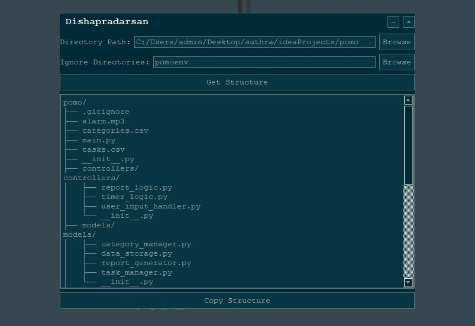

---

# दिशाप्रदर्शन (Dishāpradarśan)

**दिशाप्रदर्शन** (Dishāpradarśan) is a Python application built using PyQt5, designed to visualize directory structures with a modern interface. The app allows users to browse directories, exclude specific subdirectories, and view the hierarchical structure in a scrollable, copyable format.

## Features

- **Browse Directory**: Select a directory using the file browser or enter the path manually.
- **Ignore Directories**: Choose directories to exclude from the structure using a file browser or enter their names manually.
- **Get Structure**: Generate a visual representation of the directory structure.
- **Solarized Black Theme**: The application features a Solarized Black theme with a custom title bar.
- **Copy to Clipboard**: Easily copy the directory structure to your clipboard for further use.

## Installation

### Prerequisites

- Python 3.x
- PyQt5
- Pyperclip (for clipboard functionality)

### Steps

1. Clone the repository:

   ```bash
   git clone <repository-url>
   cd <repository-name>
   ```

2. Install the required Python packages:

   ```bash
   pip install PyQt5 pyperclip
   ```

3. Run the application:

   ```bash
   python main.py
   ```

## Usage

1. **Launch the Application**: Run the `main.py` file to open the application window.
2. **Select a Directory**: Enter the directory path manually or use the "Browse" button.
3. **Ignore Subdirectories**: Optionally, select or enter directories to exclude from the structure.
4. **Generate Structure**: Click the "Get Structure" button to generate the directory tree.
5. **Copy the Structure**: Use the "Copy Structure" button to copy the directory tree to your clipboard.

## Interface Overview

- **Title Bar**: Displays the application name "Dishapradarsan" with custom minimize and close buttons.
- **Path Input**: Allows you to input or browse for the directory whose structure you want to visualize.
- **Ignore Directories**: Input or browse for subdirectories you wish to exclude from the structure.
- **Output Area**: A scrollable text area where the directory structure is displayed.
- **Copy Button**: Copies the displayed structure to your clipboard.

## Screenshots



## License

This project is licensed under the MIT License - see the [LICENSE](LICENSE) file for details.

## Acknowledgments

- **Solarized Theme**: Inspired by the [Solarized color scheme](https://ethanschoonover.com/solarized/).
- **PyQt5**: The Python binding for the Qt application framework.
- **Icon**: Directory icon used in the title bar.

## Contributions

Contributions are welcome! Please feel free to submit a Pull Request or open an issue for any enhancements or bugs.

---

